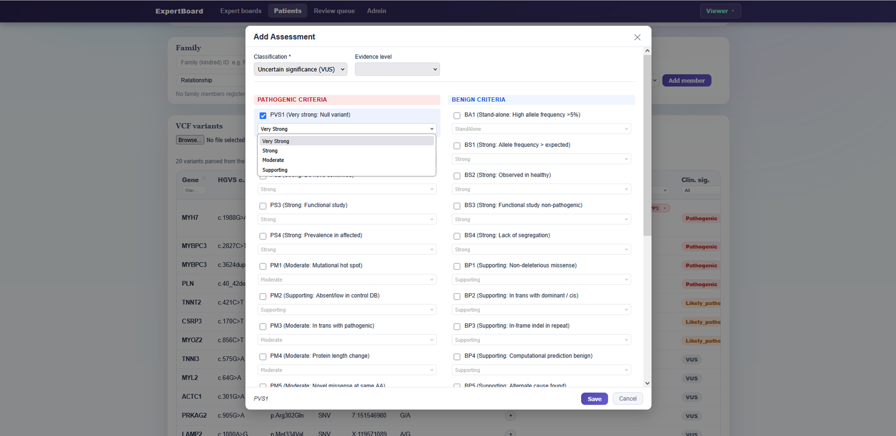
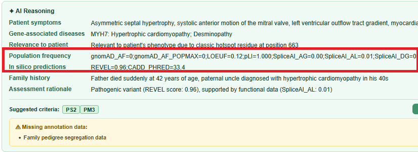

# ExpertBoard

**This build is a branch of the [llm-integration](https://github.com/PubCaseFinder/expertboard/tree/feature/llm-integration) feature from ExpertBoard.**

A web application for expert panel review of undiagnosed disease cases, built during the **MedHack 2026-07-29** hackathon.

ExpertBoard is an experimental, standalone prototype for AI-assisted complex case review. It explores reusable expert boards organized by gene, disease, or clinical domain, with ACMG-based variant assessment and Ollama LLM integration.

---

## Change Log

### 09/08/2026

Changes were made to criteria assignment so that it is more aligned to current ACMG/AMP recommendations (latest update: July 2025), [see here](https://www.clinicalgenome.org/tools/clingen-variant-classification-guidance/).

- Added modifiable ACMG scores as dropdown options - this is based on ClinGen's [*Guidance on how to rename criteria codes when strength of evidence is modified*](https://www.clinicalgenome.org/docs/clingen-sequence-variant-interpretation-working-group-recommendations-for-acmg-amp-guideline-criteria-code-modifications/).

  - By default, PM2 is now set at a supporting level of evidence as its weight was downgraded - see [*ClinGen PM2 Recommendation for Absence Rarity*](https://www.clinicalgenome.org/docs/pm2-recommendation-for-absence-rarity/).



- Removed `drug response` and `risk factors` labels from classification groups to keep the scope aligned with ACMG nomenclature.

- Added additional evidence (e.g., population frequency and in silico predictions) to the LLM review panel in `patients.py`. This is an illustrative example to allow the user to review the AI's decision-making for automatable ACMG criteria.

- Added a second dummy VCF with additional simulated annotation metadata which includes *in silico* prediction scores and population frequencies. This VCF can be found in `/sample-data`.

- Adjusted the LLM prompt in `llm.py` to *try* and categorize each ACMG criteria for better context and understanding (performance will still limited by the model of choice). This is somewhat achievable for PP3 and PM2 using llama 3.2 @ 32k context size.



---

## Key Features (MedHackathonAsia 2026-07-29/30)

### Patient & Variant Management
- Upload VCF files per patient (new patient creation or re-import for existing patients)
- Variant annotations parsed from VCF INFO column: gene, HGVS c./p., ClinVar significance, genotype, depth, in-silico scores
- Clinical free-text per patient (family history, phenotype description)

### Expert Board Workflow
- **Expert Boards**: country/specialty-based panels
- Patients assigned to a board appear in the board's **Waiting List**
- Board members managed via Admin panel

### Variant Assessment (ACMG-based)
- Add assessments per variant with ACMG/AMP 2015 criteria selection (27 criteria: PVS1, PS1–4, PM1–6, PP1–5, BA1, BS1–4, BP1–7)
- Auto-classification and evidence level computed from selected criteria (JS rules engine)
- Cross-patient review tracking ("Other pt. reviews" column, read-only)
- Composite sort: Clin. sig. > Other pt. reviews > Assessed

### AI-Assisted Analysis (Ollama / cloud-compatible)
- Configure the endpoint (URL, model, API key) via **Admin → LLM settings**
- Base URL should be a host/base path, not a full chat endpoint:
  - Local Ollama: `http://localhost:11434`
  - Ollama Cloud: `https://ollama.com/api`
  - OpenAI-compatible gateway: `https://your-host/v1`
  - If `/api/chat`, `/api`, or `/chat/completions` is pasted by mistake, ExpertBoard normalizes it automatically.
- Model should match the provider's published model name (example: `llama3.2`)
- The **"✦ Analyze with AI"** button appears only when:
  - LLM settings are saved in Admin
  - The patient has at least one imported variant
  - Clinical text is entered and saved for that patient
- **"✦ Analyze with AI"** — sends clinical text + VCF INFO fields to LLM
- Per-variant structured reasoning displayed in the assessment modal:
  - Patient symptoms summary
  - Gene-associated diseases
  - Relevance to patient phenotype
  - Family history interpretation
  - Assessment rationale
- **ACMG criteria suggestions** with one-click "Apply suggestions"
- **Missing data warnings**: flags annotation gaps (allele frequency, in-silico scores, de-novo status, etc.)
- Results persisted to DB (`llm_score`, `llm_reason`)

### UI / Navigation
- Sticky header with global navigation (Expert boards / Patients / Review queue / Admin)
- Role switcher dropdown (mock auth: Coordinator, Clinical Reviewer, Expert, Admin)
- Filter and search within variant tables

---

## Tech Stack

| Layer | Technology |
|-------|-----------|
| Backend | Python 3.12, Flask 3.0.3 |
| ORM | SQLAlchemy 2.0 |
| Database | MySQL 8.4 (Docker) |
| LLM | Ollama local/cloud API or OpenAI-compatible API |
| Frontend | Vanilla HTML/CSS/JS |
| Container | Docker Compose |

---

## Quick Start

- Install Docker Desktop or Docker Engine.
- Start Docker locally before running the development environment.
- Make sure ports `8010` and `13307` are available, or change them in `.env`.

## Local development

```bash
git clone https://github.com/PubCaseFinder/expertboard.git
cd expertboard
cp .env.example .env
docker compose up -d --build
```

Open:

```text
http://localhost:8010/boards
```

Create the first demo board room from the landing page.

## MVP scope

- Expert board list and demo board creation
- Case review rooms under a fixed expert board
- Review room with left-side workspace navigation
- Core board roles and optional support roles
- Phenotype, variant, hypothesis, evidence, history, and briefing views
- MySQL-backed case, member, comment, decision, and audit log tables
- PubCaseFinder API client placeholder via `PUBCASEFINDER_BASE_URL`

## Role model

Core board:

- Case chair
- Clinical reviewer
- Bioinformatician
- Laboratory scientist
- Genetic counselor

Optional support:

- Case coordinator
- External consultant
