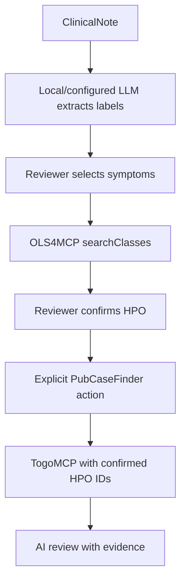
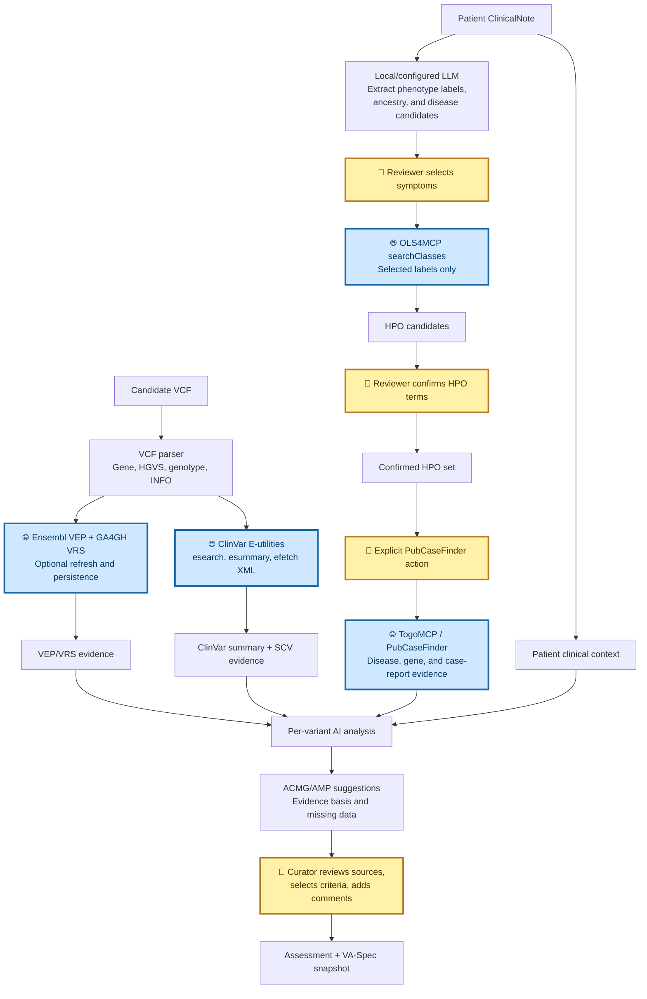

# BH26.9 Hackathon Results

## Summary

During BH26.9, ExpertBoard was extended from an ACMG-style review prototype into a more complete, human-governed clinical variant review workflow.

The work in this report covers the range:

```text
9d1ce51c0d6992dfc3d09bb268c496cd046f219c..HEAD
```

The range contains 18 commits, changes 35 files, and adds approximately 10,569 lines while removing approximately 1,691 lines.

## Main outcomes

### Variant assessment and evidence review

- Added ACMG/AMP criterion assessment with configurable evidence strength.
- Added Tavtigian-style Bayesian scoring, posterior probability, and classification.
- Added criterion comments and evidence notes for curator decisions.
- Added cross-patient assessment summaries and review prioritization.
- Added VA-Spec JSON preview and annotation snapshots for diagnosis-time traceability.
- Added curator source links for AutoPVS1, ClinVar, NCBI Variation, gnomAD, and Ensembl.
- Added `Check current status` links beside AI-suggested criteria.

### VEP and VRS annotation

- Added Ensembl VEP annotation through the GRCh38 region API.
- Added GA4GH VRS allele normalization and identifiers.
- Added persistent VEP/VRS annotation storage and query timestamps.
- Added background VEP refresh so processing can continue after the browser page is closed.
- Added progress, failure reporting, and saved-result display.
- Added validation for malformed REF/ALT values so invalid values such as `.` do not reach VRS sequence validation.
- Added Francis prioritization integration using refreshed VEP fields where available.

### ClinVar evidence

- Added a ClinVar E-utilities client.
- Added accession and HGVS-based ClinVar lookup.
- Added VCV accession fallback to the numeric ClinVar UID when ESearch does not index the accession.
- Added ClinVar `esummary` and `efetch` XML retrieval.
- Extracted SCV-level information for AI review:
  - submitter;
  - condition;
  - allele origin;
  - clinical significance;
  - review status;
  - comments and descriptions;
  - PM3 keywords such as `in trans`, `compound heterozygous`, and `biallelic`;
  - PP1 keywords such as segregation and affected/unaffected relative evidence.
- Persisted ClinVar evidence and query timestamps per Variant.
- Added a Variant Assessment-level `Fetch ClinVar` action.
- Included saved ClinVar evidence in the AI request payload.

### ClinicalNote, HPO, and privacy boundary

- Added local LLM extraction of phenotype labels and source phrases from ClinicalNote.
- Separated label extraction from external HPO resolution.
- Added reviewer selection before any external terminology search.
- Added public OLS4MCP integration using `searchClasses`.
- Added per-candidate HPO confirmation and preservation of unresolved candidates.
- Removed automatic PubCaseFinder requests after HPO confirmation.
- Restricted PubCaseFinder/TogoMCP calls to explicit user actions using confirmed HPO IDs.
- Documented that ClinicalNote text is not sent to OLS4MCP or TogoMCP.

### AI-assisted review

- Added Ollama local/cloud and OpenAI-compatible endpoint support.
- Added detailed HTTP error reporting for provider failures.
- Added per-Variant analysis for Patient-page VCF review to avoid oversized aggregate prompts.
- Added an explicit retry choice when reduced input is needed because of context limits.
- Persisted `evidence_basis` so `Evidence used for suggestions` is available in Add Assessment.
- Included refreshed VEP/VRS and saved ClinVar evidence in AI analysis.
- Added PM3/PP1-specific prompt guidance that requires direct phase or segregation evidence.

### Patient and workflow UI

- Expanded Patient detail with ClinicalNote, clinical context, HPO review, family information, VCF variants, VEP/VRS controls, AI analysis, and assessment workflows.
- Added comma-separated manual HPO entry.
- Added user guides for Patient and Assessment workflows.
- Added progress and status messages for long-running external operations.
- Added direct links and search context for curator review.

## External data-flow policy



The system is designed so that external phenotype searches are user-mediated. ClinicalNote text is not forwarded to OLS4MCP or TogoMCP.

## Analysis flow

The following flow shows how unstructured clinical data and candidate variants
become a curator-reviewable AI analysis packet. Human confirmation gates are
shown separately from external service calls.



## Runtime and tool versions

| Component | Version or endpoint |
|---|---|
| Python base image | `python:3.11-slim` |
| Flask | `3.0.3` |
| SQLAlchemy | `2.0.31` |
| PyMySQL | `1.1.1` |
| Requests | `2.32.3` |
| cryptography | `43.0.0` |
| python-dotenv | `1.0.1` |
| GA4GH VRS | `2.3.3` |
| MySQL | `8.4` |
| SeqRepo REST service | `biocommons/seqrepo-rest-service:0.2.2` |
| SeqRepo data default | `2024-12-20` |
| Ensembl VEP | REST GRCh38 region endpoint |
| OLS4MCP | `https://www.ebi.ac.uk/ols4/api/mcp` |
| TogoMCP | `https://togomcp.rdfportal.org/mcp` |
| PubCaseFinder | Via TogoMCP PubCaseFinder tools |
| Ollama | Configured at runtime via Admin settings |

## Validation and limitations

Validation performed during the work included Python compilation, template/CSS error checks, JavaScript syntax checks after Jinja neutralization, and `git diff --check`.

The repository does not contain a formal automated test suite for these workflows. External API behavior depends on network availability, provider response formats, credentials, rate limits, and the configured model. The lightweight background VEP worker continues after page close but stops if the application process is restarted.

## Commit and delivery

- Base commit: `9d1ce51c0d6992dfc3d09bb268c496cd046f219c`
- Current feature branch: `feature/llm-integration`
- Final local commit: `be527b9` (`feat: integrate ClinVar evidence into variant review`)
