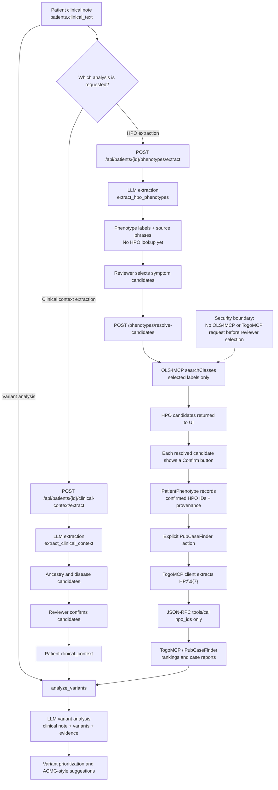

# Clinical Note Analysis

## Purpose

ExpertBoard treats the clinical note as an unstructured source for reviewable
phenotype and clinical-context candidates. The system does not send the full
clinical note to TogoMCP. Instead, it sends only confirmed HPO identifiers to
the PubCaseFinder tools.

The workflow is human-governed. External phenotype searches are blocked until
the reviewer explicitly selects the extracted symptoms:

```text
ClinicalNote -> label extraction -> reviewer selection -> OLS4MCP -> HPO confirmation -> PubCaseFinder
```

## End-to-end flow



## Processing stages

### 1. ClinicalNote is stored

The patient free-text note is stored as `Patient.clinical_text`. Saving the
note does not call TogoMCP.

### 2. Phenotype candidates are extracted

`POST /api/patients/{patient_id}/phenotypes/extract` passes the saved note to
the configured LLM. The LLM returns phenotype labels and short source phrases.
It is instructed to exclude negated, hypothetical, and family-member findings.

The extracted labels are returned to the UI without HPO lookup. No OLS4MCP or
other terminology-service request is made at this stage.

### 3. A reviewer selects symptoms for HPO lookup

The reviewer selects which extracted labels are actual patient symptoms and
clicks `Confirm symptoms and search HPO`. Only those selected labels are sent
to OLS4MCP. Unselected labels and the full ClinicalNote are not sent to the
terminology search.

The default public OLS4MCP endpoint is:

```text
https://www.ebi.ac.uk/ols4/api/mcp
```

The application calls the `searchClasses` tool with the following shape:

```json
{
  "name": "searchClasses",
  "arguments": {
    "query": "proximal muscle weakness",
    "ontologyId": "hp",
    "pageNum": 0,
    "pageSize": 20,
    "includeObsoleteEntities": false
  }
}
```

The endpoint can be overridden with `OLS4MCP_BASE_URL`.

### 4. A reviewer confirms HPO terms individually

The UI keeps all extracted symptom candidates visible. Each candidate that has
an HPO match gets its own `Confirm` button on the right side of the row. The
reviewer can confirm terms one at a time; confirming one candidate does not
remove the other unresolved candidates from the screen.

The individual confirmation is local-only. It does not call OLS4MCP again.
The application saves a `PatientPhenotype` record containing:

| Field | Meaning |
|---|---|
| `hpo_id` | Canonical HPO identifier, for example `HP:0001250` |
| `hpo_label` | Resolved HPO label |
| `source` | `clinical_text_review` or `manual_review` |
| `source_quote` | Optional phrase from the clinical note |
| `confirmed_by` | Reviewer who confirmed the term |

The note itself is not copied into the OLS4MCP request. `source_quote` remains
local provenance data.

### 5. PubCaseFinder receives HPO IDs after explicit action

The PubCaseFinder routes use either:

- HPO IDs supplied in the request, or
- HPO IDs from the patient's confirmed phenotype records.

The TogoMCP client applies a regular expression and keeps only values matching
`HP:\d{7}`. It sends those identifiers in tool arguments such as:

```json
{
  "hpo_ids": ["HP:0001250", "HP:0001263"],
  "target": "omim",
  "limit": 10
}
```

The available tools are PubCaseFinder phenotype ranking and case-report
retrieval. ClinicalNote text is not included in these JSON-RPC arguments.
HPO confirmation does not automatically start a PubCaseFinder request; the
reviewer must explicitly request gene, disease, or case-report search.

### 6. Variant analysis uses a separate LLM request

When variant analysis is requested, `analyze_variants` sends the ClinicalNote
to the configured LLM together with variant annotations. When available, it
also includes:

- reviewer-confirmed ancestry and disease context;
- PubCaseFinder rankings and case reports retrieved through TogoMCP;
- live VEP/VRS annotation data.

This means the ClinicalNote can be sent to the configured LLM, but it is not
forwarded from there to TogoMCP by the application.

## Data-boundary summary

| Destination | Data sent | Purpose |
|---|---|---|
| Configured LLM | ClinicalNote, extraction prompt, or variant-analysis context | Extract candidates and analyze variants |
| OLS4MCP | Reviewer-selected phenotype labels only | Resolve labels to HPO terms |
| TogoMCP / PubCaseFinder | Confirmed or supplied HPO IDs, target, and limits | Rank diseases/genes and retrieve case reports |

## Review and safety properties

- LLM output is treated as a candidate, not as a confirmed phenotype.
- A reviewer must select symptom candidates before any OLS4MCP search.
- A reviewer must confirm HPO candidates before they become the patient's
  confirmed phenotype set.
- Source phrases are checked against the saved note before being stored as
  provenance.
- OLS4MCP receives selected labels, not the original free-text note.
- TogoMCP uses HPO identifiers for phenotype-based search and does not receive
  the original free-text note.
- PubCaseFinder is never launched automatically after HPO confirmation.
- PubCaseFinder results are evidence for review; they do not by themselves
  establish causality or an ACMG criterion.

## Relevant implementation points

- ClinicalNote HPO extraction: `app/routes.py`,
  `/api/patients/{patient_id}/phenotypes/extract`
- ClinicalNote context extraction: `app/routes.py`,
  `/api/patients/{patient_id}/clinical-context/extract`
- LLM extraction and variant analysis: `app/llm.py`
- OLS4MCP label resolution: `app/hpo_client.py`,
  `resolve_candidates_via_ols4mcp`
- OLS4MCP transport: `app/togomcp_client.py`, `search_ols4_classes`
- PubCaseFinder/TogoMCP calls: `app/togomcp_client.py`,
  `collect_pubcasefinder_*`