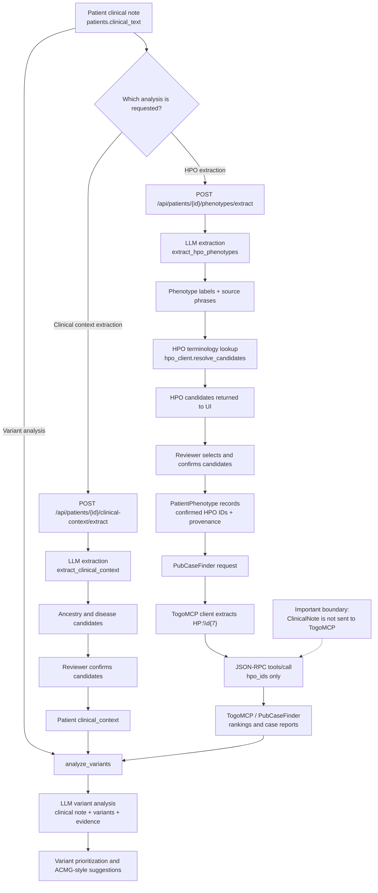

# Clinical Note Analysis

## Purpose

ExpertBoard treats the clinical note as an unstructured source for reviewable
phenotype and clinical-context candidates. The system does not send the full
clinical note to TogoMCP. Instead, it sends only confirmed HPO identifiers to
the PubCaseFinder tools.

The workflow is human-governed:

```text
ClinicalNote -> candidate extraction -> reviewer confirmation -> external lookup
```

## End-to-end flow



## Processing stages

### 1. ClinicalNote is stored

The patient free-text note is stored as `Patient.clinical_text`. Saving the
note does not call TogoMCP.

### 2. Phenotype candidates are extracted

`POST /api/patients/{patient_id}/phenotypes/extract` passes the saved note to
the configured LLM. The LLM returns phenotype labels and short source phrases.
It is instructed to exclude negated, hypothetical, and family-member findings.

The extracted labels are then resolved through the HPO terminology client.
This step is not a TogoMCP call.

### 3. A reviewer confirms HPO terms

The UI presents the candidates for review. On confirmation, the application
saves `PatientPhenotype` records containing:

| Field | Meaning |
|---|---|
| `hpo_id` | Canonical HPO identifier, for example `HP:0001250` |
| `hpo_label` | Resolved HPO label |
| `source` | `clinical_text_review` or `manual_review` |
| `source_quote` | Optional phrase from the clinical note |
| `confirmed_by` | Reviewer who confirmed the term |

The note itself is not copied into the TogoMCP request. `source_quote` remains
local provenance data.

### 4. TogoMCP receives HPO IDs

The PubCaseFinder routes use either:

- HPO IDs supplied in the request, or
- HPO IDs from the patient's confirmed phenotype records.

The TogoMCP client applies a regular expression and keeps only values matching
`HP:\d{7}`. It sends those identifiers in tool arguments such as:

```json
{
  "hpo_ids": ["HP:0001250", "HP:0001263"],
  "target": "omim",
  "limit": 10
}
```

The available tools are PubCaseFinder phenotype ranking and case-report
retrieval. ClinicalNote text is not included in these JSON-RPC arguments.

### 5. Variant analysis uses a separate LLM request

When variant analysis is requested, `analyze_variants` sends the ClinicalNote
to the configured LLM together with variant annotations. When available, it
also includes:

- reviewer-confirmed ancestry and disease context;
- PubCaseFinder rankings and case reports retrieved through TogoMCP;
- live VEP/VRS annotation data.

This means the ClinicalNote can be sent to the configured LLM, but it is not
forwarded from there to TogoMCP by the application.

## Data-boundary summary

| Destination | Data sent | Purpose |
|---|---|---|
| Configured LLM | ClinicalNote, extraction prompt, or variant-analysis context | Extract candidates and analyze variants |
| HPO terminology service | Extracted phenotype labels or an HPO ID | Resolve phenotype terms |
| TogoMCP / PubCaseFinder | Confirmed or supplied HPO IDs, target, and limits | Rank diseases/genes and retrieve case reports |

## Review and safety properties

- LLM output is treated as a candidate, not as a confirmed phenotype.
- A reviewer must confirm HPO candidates before they become the patient's
  confirmed phenotype set.
- Source phrases are checked against the saved note before being stored as
  provenance.
- TogoMCP uses HPO identifiers for phenotype-based search and does not receive
  the original free-text note.
- PubCaseFinder results are evidence for review; they do not by themselves
  establish causality or an ACMG criterion.

## Relevant implementation points

- ClinicalNote HPO extraction: `app/routes.py`,
  `/api/patients/{patient_id}/phenotypes/extract`
- ClinicalNote context extraction: `app/routes.py`,
  `/api/patients/{patient_id}/clinical-context/extract`
- LLM extraction and variant analysis: `app/llm.py`
- HPO normalization before external lookup: `app/togomcp_client.py`,
  `extract_hpo_ids`
- PubCaseFinder/TogoMCP calls: `app/togomcp_client.py`,
  `collect_pubcasefinder_*`