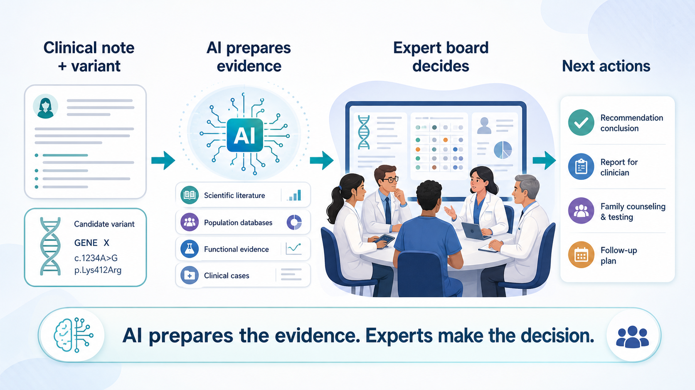
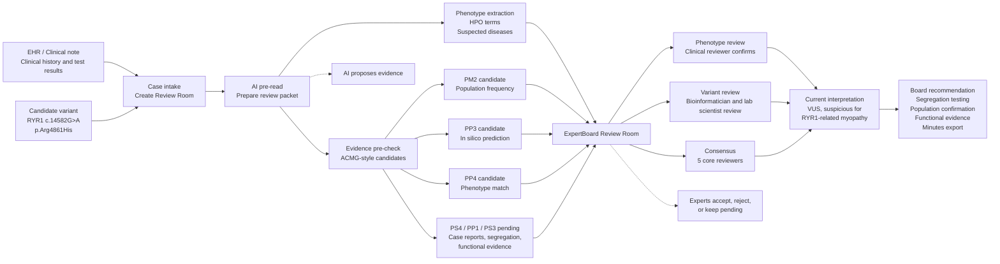

# ExpertBoard Demo Scenario

## Title

From EHR note to expert consensus for a VUS case



## Purpose

This scenario demonstrates how ExpertBoard turns an unstructured clinical note and a candidate variant into a shared, reviewable workspace for a multidisciplinary expert board.

ExpertBoard does not replace ACMG interpretation. It prepares evidence, exposes uncertainty, and lets the expert board decide.

## Scenario overview



Key message:

```text
AI prepares the evidence. The expert board makes the decision.
```

## 1. Case intake

A clinician opens a new Review Room from the Neuromuscular Disease Expert Board.

Input clinical note:

```text
A 6-year-old child presents with delayed motor milestones, proximal muscle weakness, recurrent falls, mild facial weakness, and nocturnal hypoventilation. CK is mildly elevated. Brain MRI is normal. Family history is negative. Trio exome sequencing identified a rare heterozygous RYR1 missense variant, c.14582G>A p.Arg4861His. No confirmed diagnosis has been made.
```

Initial structured data:

- Candidate variant: `RYR1 c.14582G>A p.Arg4861His`
- Gene: `RYR1`
- Current diagnosis: `Undiagnosed neuromuscular disorder`

## 2. AI pre-read

ExpertBoard prepares a review packet before the board meeting. The pre-read proposes evidence to review, but does not make the final interpretation.

Extracted phenotypes:

- `HP:0001270` Motor delay
- `HP:0003701` Proximal muscle weakness
- `HP:0002355` Difficulty walking
- `HP:0003202` Skeletal muscle weakness
- `HP:0002791` Hypoventilation

Suspected diseases:

- RYR1-related congenital myopathy
- Congenital myopathy
- Mitochondrial disease

Missing information:

- Parental segregation
- Functional evidence
- Detailed muscle biopsy or muscle imaging findings
- Population frequency confirmation

## 3. Evidence pre-check

The system gathers evidence sources and proposes ACMG-style criteria candidates.

Criteria are proposed for expert review, not automatically accepted.

| Evidence source | Data found | Proposed criterion | Status |
|---|---|---|---|
| Population database | Variant appears rare or absent | `PM2 candidate` | Needs reviewer confirmation |
| In silico predictors | Several tools predict damaging effect | `PP3 candidate` | Supporting evidence only |
| Phenotype match | Clinical features fit RYR1-related myopathy | `PP4 candidate` | Needs clinical confirmation |
| Literature and case reports | Insufficient case-level evidence | `PS4 pending` | Not accepted yet |
| Family segregation | Parents not yet reviewed | `PP1 pending` | Waiting for parental testing |
| Functional assay | No functional assay available | `PS3 pending` | Not available |

## 4. Phenotype review

The clinical reviewer checks whether the extracted HPO terms match the clinical note.

Board decision:

- Accept motor delay, proximal weakness, difficulty walking, and skeletal muscle weakness.
- Keep hypoventilation as relevant but needing clinical confirmation.
- RYR1-related congenital myopathy remains plausible.
- Mitochondrial disease remains a differential diagnosis.

## 5. Variant review

The bioinformatician and laboratory scientist review the ACMG-style evidence candidates.

Board positions:

- `PM2`: likely acceptable after population frequency confirmation.
- `PP3`: acceptable as supporting evidence only.
- `PP4`: acceptable if phenotype review confirms RYR1 fit.
- `PS4`: not accepted yet.
- `PP1`: pending parental testing.
- `PS3`: pending functional evidence.

Current interpretation:

```text
VUS, suspicious for RYR1-related myopathy
```

## 6. Consensus

The board does not diagnose automatically. It agrees on the current diagnostic direction and next actions.

Consensus:

```text
4 of 5 core reviewers support the current diagnostic direction.
```

Core reviewer positions:

- Case chair: Support
- Clinical reviewer: Support
- Bioinformatician: Conditional
- Laboratory scientist: Support
- Genetic counselor: Support

## 7. Board recommendation

Next actions:

- Confirm population frequency.
- Perform parental segregation testing.
- Review muscle biopsy or imaging if available.
- Reassess ACMG-style criteria after additional evidence.
- Export board minutes with evidence, uncertainty, and reviewer positions.

## Demo message

ExpertBoard turns an unstructured clinical note and a candidate variant into a shared, reviewable workspace.

AI prepares the evidence. The expert board makes the decision.
